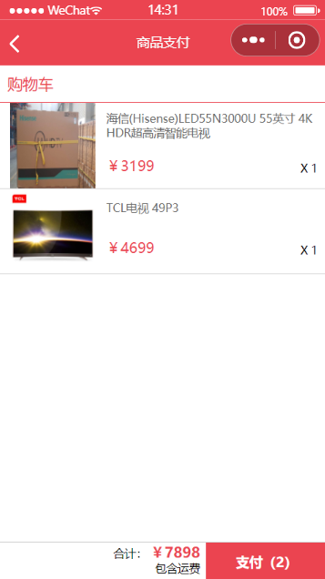
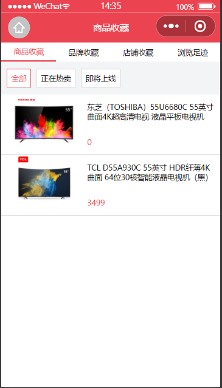

## 1、介绍

该文档是记录学习[黑马小程序开发](https://www.bilibili.com/video/BV1nE41117BQ)课程后对于课程的一些补充、总结、所遇到的问题以及一些问题的解决。文档主要包括小程序基础部分以及项目实践——黑马优购项目。

## 2、基础部分

[思维导图](https://github.com/zhengzp2019/heimayougou/blob/master/%E6%80%9D%E7%BB%B4%E5%AF%BC%E5%9B%BE.xmind)，这里只罗列需要了解的知识点，具体内容可观看[视频课程](https://www.bilibili.com/video/BV1nE41117BQ)，查阅小程序[官方文档](https://developers.weixin.qq.com/miniprogram/dev/framework/)或者[黑马文档](https://github.com/zhengzp2019/heimayougou/blob/master/%E5%BE%AE%E4%BF%A1%E5%B0%8F%E7%A8%8B%E5%BA%8F-%E5%9F%BA%E7%A1%80.pdf)。

## 3、项目实践

#### 1、 首页


1. 数据请求：微信提供的api为`wx.request`，使用之前将其封装为promise方式，并使用ES7中async方法发出异步请求。

   ```js
   let ajaxTimes = 0;
   /**
    * Promise 形式的Request
    * @param {Object} params 
    * @returns res
    */
   export const request = (params) => {
       ajaxTimes++;
       // 显示加载中效果
       wx.showLoading({
           title: "加载中",
           mask: true,
       });
   
       // 定义公共URL
       const baseUrl = "https://api-hmugo-web.itheima.net/api/public/v1";
       return new Promise((resolve, reject) => {
           wx.request({
               ...params,
               header: header,
               url: baseUrl + params.url,
               success: (result) => {
                   resolve(result.data.message);// 简化接口数据
               },
               fail: (err) => {
                   reject(err);
               },
               complete: () => {
                   ajaxTimes--;
                   if (ajaxTimes === 0) {// 关闭正在等待的图标
                       wx.hideLoading();
                   }
               }
           });
       })
   }
   ```

   

2. 这里的空间都是`navigator`，分类页面需要跳转到tabber上，故需要注意修改`open-type`内容

##### 问题及解决

这里的跳转连接是从后台请求的，而后台请求的链接有点乱，不符合开始建立的页面逻辑，所以我把这里的跳转链接基本都是写死的。


#### 2、分类页面


1. 查看官方文档学习`scroll-view`的使用方式

2. 使用点击事件使得点击左侧内容，右侧可以做出相应

   ```html
         <view
           class="menu_item {{index===currentIndex?'active':''}}"
           wx:for="{{leftMenuList}}"
           wx:key="*this"
           bindtap="handleItemTap"
           data-index="{{index}}"
         >
           {{item}}
         </view>
   ```

   ```js
     // 处理左侧点击事件
     handleItemTap(e) {
       // console.log(e);
       const { index } = e.currentTarget.dataset;
       // 构造右侧的商品数据
       let rightContent = this.Cates[index].children;
   
       this.setData({
         currentIndex: index,
         rightContent
       })
     }
   ```

3. less语言编译为wxss语法

   ```less
   // 使用'~'和字符串的形式实现wxss原样编译
   // 参考链接：https://less.bootcss.com/#%E8%BD%AC%E4%B9%89%EF%BC%88escaping%EF%BC%89
   height: ~'calc(100vh - 90rpx)';
   ```

4. 向缓存中存/取数据

   ```js
   // 存数据
   wx.setStorageSync("key",data);
   // 取数据
   wx.getStorageSync("key");
   ```
   
   

#### 3、商品列表


1. 两行显示布局

   ```less
   // 显示...效果
   display: -webkit-box;
   overflow: hidden;
   -webkit-box-orient: vertical;
   -webkit-line-clamp: 2;
   ```

#### 4、商品详情


1. 底部工具栏布局：需要使用css中定位的知识，将该组件定义在页面底部，为了使点击底部图标能够执行功能，这里将button以透明的方式显示在view组件的上面
2. 分享与联系客服功能需要分别修改button按钮的`open-type`属性

#### 5、购物车


1. 获取收获地址按钮在获取地址成功后需要显示地址，需要使用条件渲染页面
2. 该页面的逻辑功能实现较为复杂

#### 6、支付



1. 该功能需要企业账号才能实现，这里的token并不是从小程序后台请求的仅仅使用一个测试token，测试该页面逻辑

   `BearereyJhbGciOiJIUzI1NiIsInR5cCI6IkpXVCJ9.eyJ1aWQiOjIzLCJpYXQiOjE1NjQ3MzAwNzksImV4cCI6MTAwMTU2NDczMDA3OH0.YPt-XeLnjV-_1ITaXGY2FhxmCe4NvXuRnRB8OMCfnPo`

#### 7、个人中心


1. 这里需要获取用户个人信息，视频中使用的方法现以不维护，这里使用的是`wx.getUserProfile`方法

   ```js
   /**
    * promise 形式  getUserProfile
    * @param {Object} param0 参数
    * @returns 
    */
   export const getUserProfile = ({ desc }) => {
       return new Promise((resolve, reject) => {
           wx.getUserProfile({
               desc: desc, // 声明获取用户个人信息后的用途，后续会展示在弹窗中，请谨慎填写
               success: (res) => {
                   resolve(res);
               },
               fail: (err) => {
                   reject(err);
               }
           });
       })
   }
   ```

2. 图像模糊效果需要用到CSS3的滤镜方法

   ```css
   filter: blur(10rpx);
   ```

#### 8、授权


1. 授权功能与获取用户个人信息功能相同

#### 9、订单查询


#### 10、商品收藏



#### 11、搜索


1. 为了防止程序多次请求在搜索框中添加防抖功能

   ```js
   // 防抖 功能
   clearTimeout(this.TimeId);
   this.TimeId = setTimeout(() => {
       this.qSearch(value);
   }, 1000);
   ```

#### 12、意见反馈


## 附录

#### 1、工具

- [vscode](https://code.visualstudio.com/)及其开发插件

  - easy less

    ```json
      "less.compile": {
        "outExt": ".wxss",
        "sourceMap": false
      },
    ```

  - wechat-snippet

  - 小程序开发助手

  - CSS Tree

  - wxapp-helper

    ```json
      "wxapp-helper.namingConvention": "camelcase",
      "wxapp-helper.component.typescript": false,
      "wxapp-helper.component.name": "",
      "wxapp-helper.component.json": "{\n  \"component\": true\n}",
      "wxapp-helper.component.wxml": "",
      "wxapp-helper.component.script": "base64:Q29tcG9uZW50KHsKICBkYXRhOiB7fSwKICBwcm9wZXJ0aWVzOiB7fSwKICBtZXRob2RzOiB7fSwKICBvcHRpb25zOiB7CiAgICBhZGRHbG9iYWxDbGFzczogdHJ1ZQogIH0KfSk=",
      "wxapp-helper.component.wxss": "",
    ```

  - WXML-Language Services

    ```json
      "minapp-vscode.disableAutoConfig": true,
      "minapp-vscode.wxmlFormatter": "prettier", //指定格式化工具
      "minapp-vscode.prettyHtml": {
        // prettyHtml 默认配置
        "useTabs": false,
        "tabWidth": 2,
        "printWidth": 100,
        "singleQuote": false,
        "usePrettier": true,
        "wrapAttributes": true,
        "sortAttributes": true
      },
      "minapp-vscode.prettier": {
        //prettier 更多参考https://prettier.io/docs/en/options.html
        "useTabs": false,
        "tabWidth": 2,
        "printWidth": 100,
        "singleQuote": false
      },
    ```

    

  

- [微信开发者工具](https://developers.weixin.qq.com/miniprogram/dev/devtools/download.html)

- [Snipaste](https://www.snipaste.com/)(截图工具)

#### 2、参考文档

- [MDN](https://developer.mozilla.org/zh-CN/)
- [微信小程序开发文档](https://developers.weixin.qq.com/miniprogram/dev/framework/)
- [黑马课程文档](https://github.com/zhengzp2019/heimayougou/blob/master/%E5%BE%AE%E4%BF%A1%E5%B0%8F%E7%A8%8B%E5%BA%8F-%E5%9F%BA%E7%A1%80.pdf)

#### 3、代码中用到的全部Promise封装

```js
/**
 * promise 形式  chooseAddress
 */
export const chooseAddress = () => {
    return new Promise((resolve, reject) => {
        wx.chooseAddress({
            success: (result) => {
                resolve(result);
            },
            fail: (err) => {
                reject(err);
            }
        });
    })
}

/**
 * promise 形式  showModal
 * @param {Object} param0 参数
 * @returns 
 */
export const showModal = ({ content }) => {
    return new Promise((resolve, reject) => {
        wx.showModal({
            title: '提示',
            content: content,
            success: (res) => {
                resolve(res);
            },
            fail: (err) => {
                reject(err);
            }
        })
    })
}

/**
 * promise 形式  showToast
 * @param {Object} param0 参数
 * @returns 
 */
export const showToast = ({ title }) => {
    return new Promise((resolve, reject) => {
        wx.showToast({
            title: title,
            icon: 'none',
            mask: true,
            success: (res) => {
                resolve(res);
            },
            fail: (err) => {
                reject(err);
            }
        })
    })
}

/**
 * promise 形式  getUserProfile
 * @param {Object} param0 参数
 * @returns 
 */
export const getUserProfile = ({ desc }) => {
    return new Promise((resolve, reject) => {
        wx.getUserProfile({
            desc: desc, // 声明获取用户个人信息后的用途，后续会展示在弹窗中，请谨慎填写
            success: (res) => {
                resolve(res);
            },
            fail: (err) => {
                reject(err);
            }
        });
    })
}

/**
 * promise 形式  login
 * @returns 
 */
export const login = () => {
    return new Promise((resolve, reject) => {
        wx.login({
            timeout: 10000,
            success: (result) => {
                resolve(result);
            },
            fail: (err) => {
                reject(err);
            },
        });
    })
}

/**
 * promise 形式 requestPayment
 * @param {Object} pay 小程序的微信支付
 * @returns 
 */
export const requestPayment = (pay) => {
    return new Promise((resolve, reject) => {
        wx.requestPayment({
            ...pay,
            success: (result) => {
                resolve(result);
            },
            fail: (err) => { reject(err); }
        });

    })
}
let ajaxTimes = 0;

/**
 * Promise 形式的Request
 * @param {Object} params 
 * @returns res
 */
export const request = (params) => {
    // 判断url中是否带有 /my/请求的私有的路径 带上header token
    let header = { ...params.header };
    if (params.url.includes("/my/")) {
        // 拼接header 带上token
        header["Authorization"] = wx.getStorageSync("token");
    }
    ajaxTimes++;
    // 显示加载中效果
    wx.showLoading({
        title: "加载中",
        mask: true,
    });

    // 定义公共URL
    const baseUrl = "https://api-hmugo-web.itheima.net/api/public/v1";
    return new Promise((resolve, reject) => {
        wx.request({
            ...params,
            header: header,
            url: baseUrl + params.url,
            success: (result) => {
                resolve(result.data.message);// 简化接口数据
            },
            fail: (err) => {
                reject(err);
            },
            complete: () => {
                ajaxTimes--;
                if (ajaxTimes === 0) {// 关闭正在等待的图标
                    wx.hideLoading();
                }
            }
        });
    })
}
```

